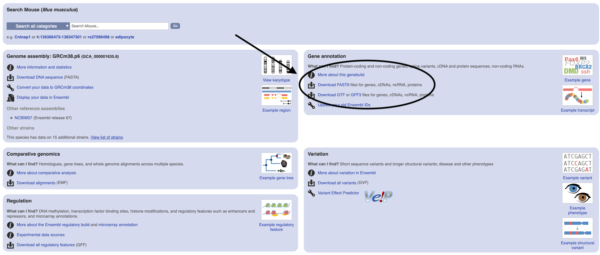
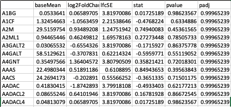

##  Transcriptomics Workshop

In this workshop, we will do several steps to analyze transcriptomics data. We will start with data quantification, followed by differential expression and functional analysis. As for the data, we will be using publicly available data [PRJNA412001](https://www.ebi.ac.uk/ena/data/view/PRJNA412001).

Related Publication: [HIF1 Mediates a Switch in Pyruvate Kinase Isoforms After Myocardial Infarction](https://pubmed.ncbi.nlm.nih.gov/29652636-hif1-mediates-a-switch-in-pyruvate-kinase-isoforms-after-myocardial-infarction/)

### Quantification of the data

To quantify the data, we will use a software called Kallisto.

#### Install Kallisto

Kallisto has been installed in your pre-course preparation step. If you want to install it, please refer to [their website](https://pachterlab.github.io/kallisto/about)

#### Kallisto for FASTQ Quantifications

Our goal in this step is to translate the FASTQ files from RNA-seq analysis to understandable quantified numbers (raw count and TPM).

1. Download several files:

  * the fastq files from the [data repository](https://www.ebi.ac.uk/ena/data/view/PRJNA412001). **Note:** For the sake of the time, just download a condition (2 fastq files --> paired).

  * cDNA file from Ensembl website for Mouse (Mus Musculus). Look for "Mus_musculus.GRCm38.cdna.all.fa.gz"
  
  
  
  * Mapping of transcript to gene name in [Biomart](https://www.ensembl.org/biomart/martview). Select "Ensembl Gene 99" --> "Mouse genes (GRCm38.p6)". In the "Filter" tab (left), select "Gene", then select "protein_coding" for both "Gene Type" and "Transcript Type". Next, select "Attributes" tab (left), select "Gene" --> select only "Transcript Stable ID Version", "Gene Stable ID", and "Gene Name". You can select whatever you like, on top of those three features. Click on "Count" (make sure you have "22191/56289 Genes") and then "Result" (above), download the Result as TSV.
  
  

2. Create Index File. Index file only needs to be created once, unless you want to change the reference genome/species

```shell
$ kallisto index -i [AnyIndexName] /your_path_to/Mus_musculus.GRCm38.cdna.all.fa.gz
```

3. Quantify the FASTQ files. You can process a paired and replicated fastq files together, but make sure that it is belong to one sample. This might take a while

```shell
$ kallisto quant -i [AnyIndexName] -o /path_where_you_want/to_store_your_result/ /your_path_to/fastq1.tar.gz /your_path_to/fastq2.tar.gz
```

4. Once the process is completed, in your output directory, you will have several files: "abundance.h5", "abundance.tsv", "run_info.json". Open "abundance.tsv" in excel, and see what data that you get from Kallisto (hint: look at the column name)

### Consolidating multiple Kallisto samples

**Goal:** Converting single sample tsv into two big tables with rownames of gene name and column name of the value (one for raw count, one for TPM).

1. Download the Kallisto result from all 8 samples in [this link](data/KallistoResults.zip). Unzip it into a folder.

2. Open Rstudio and run this script. Don't forget to enter the path to the unzipped folder. This script is combining multiple samples into a big dataframe of count and TPM values. Remember, this is still in transcript level.

```R
result_dir = 'data/' # The directory that includes the extracted folders

count_tr = data.frame()
tpm_tr = data.frame()

for(i in list.dirs(result_dir,recursive=F)){
  temp = read.csv(paste0(i,'/abundance.tsv'),sep='\t',stringsAsFactors = F)
  temp_count = data.frame(temp$est_counts)
  temp_tpm = data.frame(temp$tpm)
  colnames(temp_count) = gsub("data//", "", i)
  colnames(temp_tpm) = gsub("data//", "", i)
  if(ncol(count_tr) == 0){
    count_tr = temp_count
    rownames(count_tr) = temp$target_id
    tpm_tr = temp_tpm
    rownames(tpm_tr) = temp$target_id
  } else {
    count_tr = cbind(count_tr, temp_count)
    tpm_tr = cbind(tpm_tr,temp_tpm)
  }
}
```

3. Combining the transcripts into the gene names: Merge the transcripts into gene names. Remember that earlier we chose only protein_coding gene and transcripts mapping from Biomart.

```R
biomart_file = 'mart_export.txt' #adjust this based on your file location
mapping = read.csv(biomart_file,sep='\t',stringsAsFactors = F,row.names = 1)
count_gn = merge(count_tr,mapping['Gene.name'], by=0,all=F) # merge only for the shared row names
count_gn = count_gn[,2:ncol(count_gn)]
count_gn = aggregate(.~Gene.name, count_gn, sum)
rownames(count_gn) = count_gn$Gene.name 
tpm_gn = merge(tpm_tr,mapping['Gene.name'], by=0,all=F) # merge only for the shared row names
tpm_gn = tpm_gn[,2:ncol(tpm_gn)]
tpm_gn = aggregate(.~Gene.name, tpm_gn, sum)
rownames(tpm_gn) = tpm_gn$Gene.name
```

**Question: How many protein coding transcripts and genes that we have?**

4. Save the count and TPM table as tab-separated format.

```R
write.table(count_gn,file='/path_to_save/count_gene.txt',sep = '\t', na = '',row.names = F)
write.table(tpm_gn,file='/path_to_save/tpm_gene.txt',sep = '\t', na = '',row.names = F)
```
### Data Exploration

Once we have the consolidated table, we have to look at the data to understand it better. In this step, we will do a simple PCA analysis to see the data separation of each condition.

1. Download the [metadata file](data/metadata.txt) and load it together with TPM table that we generated to R. 

**Question: Why TPM and not raw count?**

```R
metadata_file = 'metadata.txt' #adjust this based on your file location
metadata = read.csv(metadata_file,sep='\t',stringsAsFactors = F,row.names = 1)

tpm_file = 'tpm_gene.txt' #adjust this based on your file location
tpm = read.csv(tpm_file,sep='\t',stringsAsFactors = F,row.names = 1)[,rownames(metadata)] # make sure that sequence of metadata is the same with tpm
```

2. Perform the PCA with the script below.

```R
PCA=prcomp(t(tpm), scale=F)
plot(PCA$x,pch = 15,col=c('blue','red','lightgreen','black'))
```

**Question: What do you think of the sample separations?**


### Differential Expression Analysis

To perform differential expression analysis, we will use a package in R called [DESeq2](http://bioconductor.org/packages/release/bioc/html/DESeq2.html).

1. Load the count and metadata to R
```R
res <- deseq(haha)
```

2. Perform the Differential Expression Analysis
**Question: Why count and not TPM?**

```R
library('DESeq2')
conds=as.factor(conds)
coldata <- data.frame(row.names=subject,conds)
dds <- DESeqDataSetFromMatrix(countData=as.matrix(count),colData=coldata,design=~conds)
dds <- DESeq(dds)
```

3. Retrieve the specific comparison results. For now, retrive comparison between MI_1D vs SHAM_1D.

```R
cond1 = MI_1D #First Condition
cond2 = SHAM_1D #Reference Condition
res=results(dds,contrast=c('conds',cond1,cond2))
res=data.frame(res)
```

4. Retrive comparison between MI_3D vs SHAM_3D as well

5. Save it as TSV file

```R
cond1 = MI_1D #First Condition
cond2 = SHAM_1D #Reference Condition
res=results(dds,contrast=c('conds',cond1,cond2))
res=data.frame(res)
```

6. Open the saved result for MI_1D vs SHAM_1D.

**Question: With Adjusted P-value < 0.05, how many genes are significantly differentially up-regulated? down-regulated? (HINT: Look at Log2FoldChange) What is the most affected gene?**


